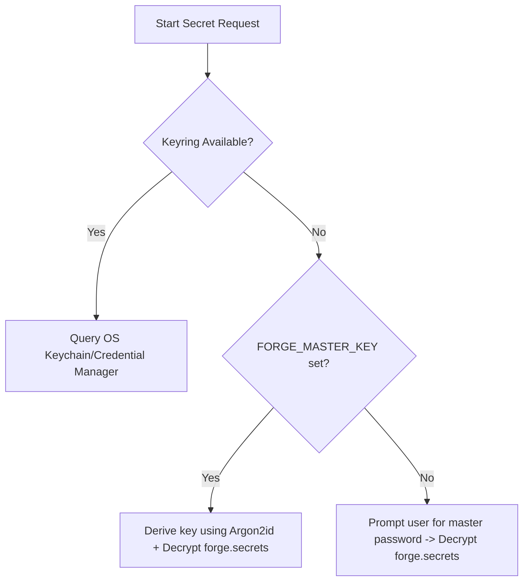

## Exploration: forge-config-secrets

### Current State
Currently, `forge` loads configuration in a very simple manner:
1. Manifest loading parses only active runtimes from `forge.toml` via `load_config`.
2. Environment variables are parsed from a local `forge.env` file via `parse_env_file`.
3. Secret detection is purely heuristic-based (`is_secret` checking if keys contain "secret", "token", etc.), masking them only for AI context printing.
4. There is no formalized precedence stack, no support for encrypted secrets, no OS keyring integration, and no validation of configurations (e.g., types, patterns).

---

### Affected Areas
- `crates/forge-core/src/manifest.rs` — Update the `ForgeConfig` struct to support declarative configuration schemas under `[config.definitions]` and default environment blocks.
- `crates/forge-core/src/environment.rs` — Implement the precedence resolver, key-value materialization engine, and validation checks.
- `crates/forge-core/src/lib.rs` — Re-export configuration and secrets provider interfaces.
- `crates/forge-core/src/types.rs` / New Module — Introduce `SecretProvider` and `ConfigurationProvider` traits and errors.
- `crates/forge-core/src/secrets/` (New Crate or Module) — Implement built-in keyring-based (macOS Keychain, Windows Credential Manager, Linux Secret Service via DBus) and file-based (Argon2id + AES-256-GCM) fallback providers.
- `crates/forge-cli/src/main.rs` — Update CLI commands (`run`, `shell`, `doctor`, `ai doctor`, `ai context`) to leverage the resolved config, perform validation, and handle set/get subcommands.

---

### Approaches

#### Approach 1: Simple Local File Decryption (Stateless File-based Encryption)
Store all secrets in a local `forge.secrets` file encrypted with AES-256-GCM, prompting the user for a password on every command that requires them. CLI flags override file-based keys in memory.
- **Pros:**
  - Simple to implement; no OS-specific keyring dependencies.
  - Highly portable (file can be committed to git if desired, though discouraged).
- **Cons:**
  - Poor developer experience (frequent password prompts).
  - Lacks integration with corporate vaults (1Password, AWS Secrets Manager).
  - No OS credential manager integration.
- **Effort:** Medium

#### Approach 2: Decoupled Provider-Based Configuration & Secrets Engine (Recommended)
Introduce generic traits for configuration and secret resolution. Implement local keyring integrations (macOS, Windows, Linux) and Argon2id + AES-256-GCM fallback encryption. Evaluate environment variables lazily in-memory during sandboxed execution, caching static runtime variables while fetching secrets just-in-time.
- **Pros:**
  - Seamless developer experience using secure native OS Keyrings.
  - Extensible architecture supporting plugin-based providers (e.g., AWS Secrets Manager, 1Password CLI).
  - Hybrid materialization ensures excellent performance without compromising security or freshness.
  - Strict schema-based validation via `forge doctor` and rich metadata injection into AI context.
- **Cons:**
  - High initial development overhead.
  - Adds dependency on `keyring` crate and crypto crates (`argon2`, `aes-gcm`).
- **Effort:** High

---

### Detailed Design Answers

#### 1. Precedence Model
To guarantee deterministic resolution, we define a strict precedence stack. Resolving a configuration or secret key starts at the highest priority layer and moves downward until the key is found:

```
[Priority 1] CLI Flags (e.g. forge run --set KEY=val)
     ↓
[Priority 2] System Environment Overrides (matching prefix FORGE_VAR_<KEY>)
     ↓
[Priority 3] Local Developer Overrides (forge.local.toml)
     ↓
[Priority 4] Keyring / Secrets Providers (forge.secrets -> OS Keyring / External Vaults)
     ↓
[Priority 5] Flat Environment File (forge.env)
     ↓
[Priority 6] Project Manifest (forge.toml [env] and [config] sections)
     ↓
[Priority 7] Schema Defaults (forge.toml [config.definitions.<KEY>] default value)
```

**Conflict Resolution Rules:**
- **Case Sensitivity:** All keys are case-sensitive.
- **Type Coercion:** Values retrieved from CLI flags, env files, and keyrings are strings. Type coercion (e.g., string to integer or boolean) is evaluated at the end of the resolution process against the validation schema.
- **Scope Isolation:** Secrets defined in `forge.secrets` map a key to a specific provider backend. If a key is listed in `forge.secrets` but the provider fails to fetch it, the resolver falls back to lower precedence levels (e.g. `forge.env`) rather than crashing immediately.

---

#### 2. Provider Architecture
We define two core traits in `forge-core` to handle resolution:

```rust
use async_trait::async_trait;

#[derive(Debug, thiserror::Error)]
pub enum SecretProviderError {
    #[error("Secret key '{0}' not found in provider")]
    NotFound(String),
    #[error("Underlying OS Keyring error: {0}")]
    KeyringError(String),
    #[error("API / External tool failure: {0}")]
    ProviderError(String),
    #[error("Decryption failed: {0}")]
    DecryptionError(String),
}

#[async_trait]
pub trait SecretProvider: Send + Sync {
    fn name(&self) -> &str;
    async fn get_secret(&self, key: &str) -> Result<Option<String>, SecretProviderError>;
    async fn set_secret(&self, key: &str, value: &str) -> Result<(), SecretProviderError>;
    async fn delete_secret(&self, key: &str) -> Result<(), SecretProviderError>;
}

#[derive(Debug, thiserror::Error)]
pub enum ConfigProviderError {
    #[error("Failed to read config source: {0}")]
    ReadError(String),
    #[error("Parse failure: {0}")]
    ParseError(String),
}

#[async_trait]
pub trait ConfigurationProvider: Send + Sync {
    fn name(&self) -> &str;
    async fn get_config(&self, key: &str) -> Result<Option<String>, ConfigProviderError>;
    async fn list_keys(&self) -> Result<Vec<String>, ConfigProviderError>;
}
```

##### Plugin Extensibility:
To allow third-party integrations (e.g., 1Password, AWS Secrets Manager, HashiCorp Vault), we implement a `PluginSecretProvider` that communicates with external helper binaries using a simple JSON-RPC stdin/stdout protocol:

```toml
# Example forge.toml registry configuration
[secrets.providers.aws]
type = "plugin"
command = "forge-secret-aws"
args = ["--region", "us-east-1"]
```

At runtime, the `PluginSecretProvider` spawns the registered binary, passes a JSON request payload, and parses the response.

---

#### 3. Environment Materialization
We evaluated three approaches for environment variable injection:
- **Pre-computed/Cached on Sync:** Write resolved variables to a `.forge/env.cache` file during `forge sync`.
- **Just-in-Time (JIT) Resolution on Execution:** Resolve all variables from scratch when `forge run` or `forge shell` is called.
- **Hybrid (Lazy JIT + Cached Statics) [Recommended]:**
  - **Static / Derived Variables:** (e.g., `${workspace.root}`, `${runtime.python.path}`) are resolved and cached on disk during `forge sync` since they only change when the lockfile or workspaces are modified.
  - **Standard Configs:** Cached local configuration is loaded instantly.
  - **Dynamic Secrets:** Retrieved in-memory JIT during execution. Secrets are never written to disk. The keyring lookup adds sub-millisecond overhead, and network-based providers use short-lived local in-memory caching to avoid redundant calls during nested process execution.

| Metric | Pre-computed/Cached | Just-in-Time (JIT) | Hybrid (Recommended) |
|---|---|---|---|
| **Startup Latency** | < 1ms | 50ms - 2s (depending on API calls) | 1ms - 5ms (Keyring is local) |
| **Security** | Low (Plaintext secrets on disk) | High (In-memory only) | High (In-memory only for secrets) |
| **Freshness** | Low (Stale until next sync) | High (Always fresh) | High (Fresh secrets, cached statics) |

---

#### 4. Runtime Engine Integration
To resolve derived variables like `${runtime.python.path}` or `${workspace.root}` without causing circular dependency cycles (e.g., `ConfigManager` needing `RuntimeManager`, and `RuntimeManager` needing `ConfigManager` to look up paths), we use **Dependency Inversion**.

We introduce a low-level `RuntimeContextProvider` trait in a shared types module:

```rust
use std::path::PathBuf;

pub trait RuntimeContextProvider {
    fn get_runtime_path(&self, name: &str) -> Option<PathBuf>;
    fn get_workspace_root(&self) -> PathBuf;
}
```

The operation `Context` (or `RuntimeManager`) implements `RuntimeContextProvider`. The `ConfigResolver` accepts a reference to `&dyn RuntimeContextProvider` during evaluation:

```rust
pub struct ConfigResolver<'a> {
    context_provider: &'a dyn RuntimeContextProvider,
    custom_envs: &'a std::collections::HashMap<String, String>,
}

impl<'a> ConfigResolver<'a> {
    pub fn interpolate(&self, input: &str) -> Result<String, String> {
        // Regex matches ${variable} patterns
        // Handles:
        //  - ${workspace.root} -> context_provider.get_workspace_root()
        //  - ${runtime.python.path} -> context_provider.get_runtime_path("python")
        //  - ${env.SOME_ENV} -> System or resolved env lookup
    }
}
```

This prevents circular references since both managers only depend on the abstract traits.

---

#### 5. Security and Portability
Forge handles secrets using native secure backends on supported OSes, falling back to secure client-side cryptography when running in headless/CI environments.



##### OS Keyring Integration:
Using the `keyring` crate:
- **macOS:** Keychain Services (via the Security framework).
- **Windows:** Windows Credential Manager.
- **Linux:** Secret Service API (communicating via dbus to GNOME Keyring or KWallet).

##### Fallback Encryption Protocol:
When keyrings are unavailable (e.g. CI, Docker):
1. **Key Derivation (KDF):** **Argon2id** (configured with 64MB memory cost, 3 iterations, and parallelism of 4). Uses a random 16-byte salt saved alongside the payload.
2. **Authenticated Encryption:** **AES-256-GCM** to encrypt a JSON map of secrets.
3. **Data Integrity:** Additional Authenticated Data (AAD) binds the payload to the specific workspace ID, preventing credential reuse/copy-paste across different directories.
4. **CI Bypass:** If `FORGE_MASTER_KEY` environment variable is present, it is consumed as the master passphrase to bypass interactive prompts.

---

#### 6. Declarative Validation
We enforce schema-based validation rules directly within the `forge.toml` manifest:

```toml
[config.definitions.DATABASE_URL]
type = "string"
required = true
pattern = "^postgres://.*"
description = "Database connection string"

[config.definitions.MAX_CONNECTIONS]
type = "integer"
default = 20
description = "Maximum database connections"
```

##### Integration Points:
- **`forge doctor`:** Compares the materialized environment map against the validation rules. Returns `DoctorIssue` reports containing:
  - Missing required fields.
  - Pattern mismatches (regex failures).
  - Type conversion errors.
- **AI Context (`forge ai context`):** Emits masked configuration maps including descriptions, required flags, and type parameters. The LLM can diagnose why an environment is unhealthy without ever seeing the raw secret values.

---

### RFC-0012: Configuration & Secrets Platform (Draft)

#### Status: Draft
#### Author: sdd-explore
#### Date: 2026-07-01

#### 1. Introduction
This RFC proposes the design of the Forge Configuration & Secrets Platform. It establishes a secure, unified environment injection model that supports OS keyrings, client-side encryption fallbacks, and schema validation.

#### 2. Manifest Schema
The `forge.toml` manifest is extended with a new `[config]` table containing variable definitions:

```toml
[config.definitions.<KEY>]
type = "string" | "integer" | "boolean"
required = true | false
default = <value>
pattern = "<regex>"
description = "<text>"
secret = true | false
```

And a local `forge.local.toml` (gitignored) for developers:

```toml
[env]
DEBUG = "true"
PORT = 9000
```

#### 3. Secrets Resolution Mapping (`forge.secrets`)
The `forge.secrets` file maps secret variables to their respective providers:

```toml
# forge.secrets
[secrets]
STRIPE_API_KEY = { provider = "keyring" }
DATABASE_PASSWORD = { provider = "file", key = "db_pass_encrypted" }
AWS_SESSION_TOKEN = { provider = "aws-secrets-manager", secret_id = "prod/app/session" }
```

#### 4. API Trait Interface
Built-in Rust types for the configuration engine:

```rust
pub struct ResolvedEnvironment {
    pub variables: HashMap<String, String>,
    pub metadata: HashMap<String, VarMetadata>,
}

pub struct VarMetadata {
    pub source: ValueSource,
    pub is_secret: bool,
    pub description: Option<String>,
}

#[derive(Debug, Clone, PartialEq)]
pub enum ValueSource {
    Cli,
    SystemEnv,
    LocalToml,
    SecretsProvider(String),
    EnvFile,
    Toml,
    Default,
}
```

---

### Risks
- **Dependency Bloat:** Adding cryptography (Argon2, AES-GCM) and OS-keyring integration increases compilation time and binary size. *Mitigation:* Gate cryptographic modules behind optional Cargo features if slim shims are needed.
- **CI Keyring Failures:** Headless environments often lack DBus or credential stores, which will cause commands to fail if not handled gracefully. *Mitigation:* Detect headless states automatically and automatically fall back to `Argon2id+AES` decryption using `FORGE_MASTER_KEY`.
- **Performance Lag:** Dynamic secret loading via external providers (1Password, AWS) can add startup delays. *Mitigation:* Implement strict timeouts and log warning indicators if secret retrieval exceeds 200ms.

### Ready for Proposal
Yes. The orchestrator should proceed to define and invite `sdd-propose` to create the formal change proposal, using the details and code traits specified here.
