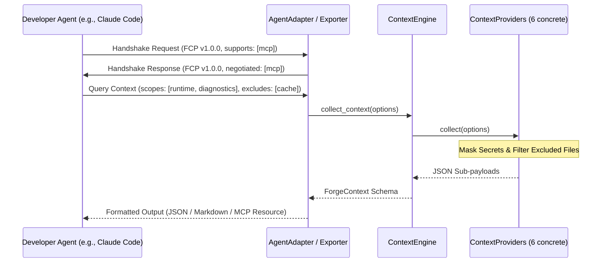

## Exploration: Runtime Context Platform / Forge Context Protocol (FCP)

### Current State
Currently, the `forge` system resolves environment variables, manages secrets, validates configurations, and compiles diagnostic reports across separate, decoupled sub-modules (`diagnostics`, `environment`, `secrets`, `resolver`, etc.). There is no unified mechanism to aggregate all of this system state into a queryable "context payload" for external developer agents (e.g. Claude Code, Gemini CLI, Aider). External AI tools must run several different commands (`forge status`, `forge doctor`, `forge explain`, `forge secret list`) and parse standard outputs, which increases latency, complexity, and context window token consumption.

### Affected Areas
- `crates/forge-core/src/lib.rs` — Will re-export the context engine, providers, schemas, and exporters.
- `crates/forge-core/src/context/mod.rs` — **New file** containing the core trait definitions (`ContextProvider`, `ContextExporter`, `AgentAdapter`), the `ContextEngine`, the six concrete providers, filters/exclusions, handshake payloads, and security rules.
- `crates/forge-cli/src/main.rs` — CLI expansion to add a `forge context` subcommand supporting format formatting, scope filtering, and exclusions.

### Approaches

1. **Monolithic Ad-Hoc CLI Exporter**
   - *Description*: Gather diagnostics, env, config, and runtimes inside the CLI layer (`forge-cli`) using simple stdout printing, without defining formal trait contracts or schemas in `forge-core`.
   - *Pros*: Quick implementation; avoids creating new traits in the core crate.
   - *Cons*: Couples logic to CLI; cannot be used programmatically via API/daemon/MCP; lacks clean secret sanitization at the core layer; lacks semantic versioning for the schema.
   - *Effort*: Low

2. **Extensible Forge Context Protocol (FCP) Core & Adapter Design (RFC-0014)**
   - *Description*: Define formal trait contracts for `ContextProvider`, `ContextExporter`, and `AgentAdapter` managed by a central `ContextEngine`. Standardize a SemVer-validated `ForgeContext` schema, implement robust scope/exclusion token optimization, build a capability negotiation handshake, and enforce strict sovereign security rules to prevent secrets leakage.
   - *Pros*: Decoupled and reusable; supports JSON, Markdown, and MCP backends; safe-by-default secret protection; easy configuration of filters/exclusions to save token window space.
   - *Cons*: Higher upfront design ceremony; requires building out six separate provider implementations.
   - *Effort*: Medium

### Recommendation
We recommend **Approach 2 (Extensible FCP Core & Adapter Design)** because it establishes a standardized framework for developer agent tool integration. By isolating providers, exporters, and adapters, we can customize outputs for various developer agents (Claude, Gemini, Aider) while keeping security checks centralized.

Below is the **RFC-0014 Draft (Forge Context Protocol Specification)** detailing the design.

---

# RFC-0014: Forge Context Protocol (FCP) Specification

## 1. Context Engine & Providers

The system architecture defines `ContextEngine` as the central coordinator, querying registered implementations of the `ContextProvider` trait.



### Core Traits & Engine

```rust
use serde::{Serialize, Deserialize};
use serde_json::Value as JsonValue;
use std::collections::HashMap;
use std::sync::Arc;

pub trait ContextProvider: Send + Sync {
    /// Returns the unique key/identifier of the provider (e.g., "runtime", "diagnostics")
    fn name(&self) -> &'static str;

    /// Collects and returns the context data as a JSON Value, respecting exclusions
    fn collect(&self, options: &ContextOptions) -> Result<JsonValue, String>;
}

pub struct ContextEngine {
    providers: HashMap<&'static str, Arc<dyn ContextProvider>>,
}

impl ContextEngine {
    pub fn new() -> Self {
        Self {
            providers: HashMap::new(),
        }
    }

    pub fn register(&mut self, provider: Arc<dyn ContextProvider>) {
        self.providers.insert(provider.name(), provider);
    }

    pub fn collect_context(&self, options: &ContextOptions) -> Result<ForgeContext, String> {
        let mut context = ForgeContext::new();

        for (&name, provider) in &self.providers {
            // Check if the scope is active/requested
            if !options.is_scope_enabled(name) {
                continue;
            }

            match provider.collect(options) {
                Ok(data) => {
                    context.insert_scope(name, data);
                }
                Err(err) => {
                    // Non-blocking log or soft error representation in the metadata
                    context.add_error(name, err);
                }
            }
        }

        Ok(context)
    }
}
```

### The Six Concrete Providers

| Provider | Scope Key | Description | Extracted Data Fields |
|----------|-----------|-------------|-----------------------|
| **Runtime** | `runtime` | Lists available and active runtimes, path mappings, and active shims | `active_runtimes`, `lockfile_summary`, `bin_dirs` |
| **Configuration** | `configuration` | Extracts `forge.toml` configurations, active profile, and variables | `definitions`, `active_profile`, `manifest_vars` |
| **Diagnostics** | `diagnostics` | Queries environment health, execution checks, and diagnostic findings | `health_score`, `findings`, `elapsed_ms` |
| **Workspace** | `workspace` | Scans workspace root layout, structure, and file locations | `workspace_root`, `file_tree`, `lockfile_exists` |
| **Environment** | `environment` | Gathers non-sensitive system environment variables and platform data | `platform`, `arch`, `os`, `masked_env_vars` |
| **Secrets** | `secrets` | Queries presence, metadata, and sources of credentials without plaintext values | `providers`, `secrets_metadata` |

1. **RuntimeContextProvider**: Reads the active workspace `forge.lock` and local cache directory mapping (`.forge/runtimes`). Lists active runtimes and versions.
2. **ConfigurationContextProvider**: Reads `forge.toml`. Inspects configuration variables, active profiles, and fallback overlays.
3. **DiagnosticsContextProvider**: Spawns or queries the `DiagnosticEngine` in fast or deep mode. Captures diagnostic reports and suggested quick fixes.
4. **WorkspaceContextProvider**: Performs light tree traversals of the workspace directory. Generates file trees and sizes, excluding paths designated in the options.
5. **EnvironmentContextProvider**: Captures `std::env::vars()` filtering out any sensitive/masked strings using `is_secret(key)`. Captures platform architectures.
6. **SecretsContextProvider**: Queries keyring backends and fallback encrypted payloads to see which secret keys are registered, verifying if they have values set, without retrieving plaintext.

---

## 2. Forge Context Schema v1

The unified data payload is defined as a strongly typed Rust struct with semantic versioning.

```rust
use chrono::{DateTime, Utc};

#[derive(Debug, Clone, Serialize, Deserialize)]
pub struct ForgeContext {
    pub metadata: ContextMetadata,
    
    #[serde(skip_serializing_if = "Option::is_none")]
    pub runtime: Option<RuntimeContextData>,
    
    #[serde(skip_serializing_if = "Option::is_none")]
    pub configuration: Option<ConfigurationContextData>,
    
    #[serde(skip_serializing_if = "Option::is_none")]
    pub diagnostics: Option<DiagnosticContextData>,
    
    #[serde(skip_serializing_if = "Option::is_none")]
    pub workspace: Option<WorkspaceContextData>,
    
    #[serde(skip_serializing_if = "Option::is_none")]
    pub environment: Option<EnvironmentContextData>,
    
    #[serde(skip_serializing_if = "Option::is_none")]
    pub secrets: Option<SecretsContextData>,
}

#[derive(Debug, Clone, Serialize, Deserialize)]
pub struct ContextMetadata {
    pub schema_version: String,  // Semantic versioning (e.g. "1.0.0")
    pub forge_version: String,   // Cli / engine version (e.g. "0.1.0")
    pub generated_at: DateTime<Utc>,
    pub errors: HashMap<String, String>, // Capture partial failures per provider
}

impl ForgeContext {
    pub fn new() -> Self {
        Self {
            metadata: ContextMetadata {
                schema_version: "1.0.0".to_string(),
                forge_version: env!("CARGO_PKG_VERSION").to_string(),
                generated_at: Utc::now(),
                errors: HashMap::new(),
            },
            runtime: None,
            configuration: None,
            diagnostics: None,
            workspace: None,
            environment: None,
            secrets: None,
        }
    }

    pub fn insert_scope(&mut self, name: &str, data: JsonValue) {
        match name {
            "runtime" => self.runtime = serde_json::from_value(data).ok(),
            "configuration" => self.configuration = serde_json::from_value(data).ok(),
            "diagnostics" => self.diagnostics = serde_json::from_value(data).ok(),
            "workspace" => self.workspace = serde_json::from_value(data).ok(),
            "environment" => self.environment = serde_json::from_value(data).ok(),
            "secrets" => self.secrets = serde_json::from_value(data).ok(),
            _ => {}
        }
    }

    pub fn add_error(&mut self, scope: &str, error: String) {
        self.metadata.errors.insert(scope.to_string(), error);
    }
}
```

---

## 3. Exporters & Agent Adapters

To present the context to developer agents in their native formats, we split formatting into exporters (serialization) and adapters (agent-specific packaging).

### Context Exporters

```rust
pub trait ContextExporter: Send + Sync {
    fn name(&self) -> &'static str;
    
    /// Serializes/exports the collected context to a string
    fn export(&self, context: &ForgeContext) -> Result<String, String>;
}
```

- **JsonExporter**: Serializes the `ForgeContext` into a structured, minified, or pretty-printed JSON string. Ideal for downstream program parsing.
- **MarkdownExporter**: Generates a clean, readable markdown document. Uses tables for environment variables, diagnostic boxes with severity levels (`INFO`, `WARNING`, `ERROR`, `CRITICAL`), and nested lists for workspace and runtimes. Optimized for LLM reading.
- **McpExporter**: Acts as a Model Context Protocol resource/tool mapping. Translates queries into standard MCP responses.

### Agent Adapters

```rust
pub trait AgentAdapter: Send + Sync {
    fn name(&self) -> &'static str;
    
    /// Wraps the exported context in the agent-specific execution harness / prompt frame
    fn adapt(&self, context: &ForgeContext, exporter: &dyn ContextExporter) -> Result<String, String>;
}
```

- **ClaudeCodeAdapter**: Formats the context into structured XML blocks:
  ```xml
  <forge_context version="1.0.0">
    <runtimes>...</runtimes>
    <diagnostics_report health="85">...</diagnostics_report>
  </forge_context>
  ```
- **GeminiCliAdapter**: Translates the context into raw JSON or formatted stdout suitable for ingestion by standard Gemini system instruction injection.
- **AiderAdapter**: Focuses heavily on the `workspace` and `runtime` scopes. Emits directory maps and active dependencies to feed Aider’s repository map framework.

---

## 4. Scopes and Exclusions

To operate within restricted agent token windows, the context system must allow fine-grained controls to prune large chunks of output.

```rust
#[derive(Debug, Clone, Serialize, Deserialize)]
pub struct ContextOptions {
    /// Active scopes (e.g., ["runtime", "diagnostics"])
    pub scopes: Vec<String>,
    
    /// Active exclusions
    pub exclusions: Vec<ExclusionBlock>,
}

#[derive(Debug, Clone, PartialEq, Eq, Hash, Serialize, Deserialize)]
#[serde(rename_all = "kebab-case")]
pub enum ExclusionBlock {
    History,          // Excludes past operations list and trace journals
    Cache,            // Excludes cache directories, build outputs, target folders, and node_modules
    FileContents,     // Returns file paths and metrics but excludes file previews
    DiagnosticLogs,   // Excludes full stdout/stderr of diagnostic checks, keeping only summaries
}

impl ContextOptions {
    pub fn is_scope_enabled(&self, scope: &str) -> bool {
        if self.scopes.iter().any(|s| s == "all") {
            return true;
        }
        self.scopes.iter().any(|s| s == scope)
    }

    pub fn should_exclude(&self, block: ExclusionBlock) -> bool {
        self.exclusions.contains(&block)
    }
}
```

### Exclude Commands
The CLI subcommands parse these options:
- `forge context --scope runtime --scope diagnostics`
- `forge context --exclude-cache --exclude-history`

---

## 5. Capability Negotiation

When an external agent connects to the Forge daemon or initiates FCP context queries, capability negotiation is performed using a handshake payload.

### Client Handshake Payload
```json
{
  "protocol": "FCP",
  "version": "1.0.0",
  "client": {
    "name": "Claude Code",
    "version": "0.2.1"
  },
  "capabilities": {
    "scopes": ["runtime", "configuration", "diagnostics", "workspace", "environment", "secrets"],
    "exporters": ["json", "markdown", "mcp"],
    "features": {
      "live_reload": true,
      "incremental_updates": false,
      "interactive_remediation": true
    }
  }
}
```

### Server Response Payload
```json
{
  "protocol": "FCP",
  "version": "1.0.0",
  "server": {
    "name": "forge",
    "version": "0.1.0"
  },
  "status": "connected",
  "negotiated_capabilities": {
    "scopes": ["runtime", "configuration", "diagnostics", "workspace", "environment", "secrets"],
    "exporters": ["json", "markdown"],
    "features": {
      "live_reload": false,
      "incremental_updates": false,
      "interactive_remediation": true
    }
  }
}
```

---

## 6. Sovereign Security

To prevent sensitive credentials and private keys from leaking to external LLM provider APIs, the system enforces strict security policies directly within the `ContextEngine` and `SecretsContextProvider`.

```
                    Sovereign Security Boundary
+-----------------------------------------------------------------+
|  [Keyring] [Secrets File]                                       |
|       |                                                         |
|       v (Plaintext Retrieval)                                   |
|  [SecretProvider]                                               |
+-------|---------------------------------------------------------+
        |                                                         |
        | (Presence verification only)                            |
        v                                                         |
+-----------------------------------------------------------------+
|  [SecretsContextProvider]                                       |
|       |                                                         |
|       v (Plaintext Forbidden!)                                  |
|  [ContextEngine] -> ForgeContext (metadata only, no plaintext)  |
|       |                                                         |
|       v                                                         |
|  [ContextExporters / AgentAdapters]                             |
|       |                                                         |
|       v                                                         |
|  [Developer Agent API (Claude, Gemini, etc.)]                   |
+-----------------------------------------------------------------+
```

### Security Enforcement Rules

1. **Presence-Only Collection**:
   The `SecretsContextProvider` MUST NOT invoke `.get(key)` on any `SecretProvider` to obtain a plaintext value during context collection. Instead, it checks existence and returns a boolean value (`is_set: bool`) and source metadata (`source: ValueSource`).

2. **Keys Filtering**:
   Only secret keys mapped via `forge.toml` configuration declarations are returned in metadata, avoiding mass discovery of arbitrary environment variables.

3. **Global String Masking**:
   The `ContextEngine` enforces a fallback sanitization sweep across all other text-based fields (such as diagnostic error logs and system environment variables) using `mask_sensitive_text`. Any value corresponding to a key matching `is_secret(key)` is masked with `[MASKED]`.

4. **Remediation Sandboxing**:
   If an agent requests secret verification or configuration (e.g. through interactive remediation in MCP), the handshake only allows the agent to trigger the action `SetSecret { key }`. The agent prompt is given a secure input hook on the user's terminal, but the agent itself is never returned the secret string.

---

### Risks
- **Token Inflation**: Workspace files scanning could still result in large payloads if `--exclude-cache` rules are not configured properly. Workspace scanner must use strict default path limits and size cutoffs (e.g., maximum file count of 100).
- **Masking Collision**: A user variable named `PASS` might accidentally mask harmless debugging variables. Masking patterns should use precise key regex bounds rather than loose substring checks where possible.

### Ready for Proposal
Yes. The orchestrator should proceed to define spec and design files for the `forge-context-platform` implementation.
