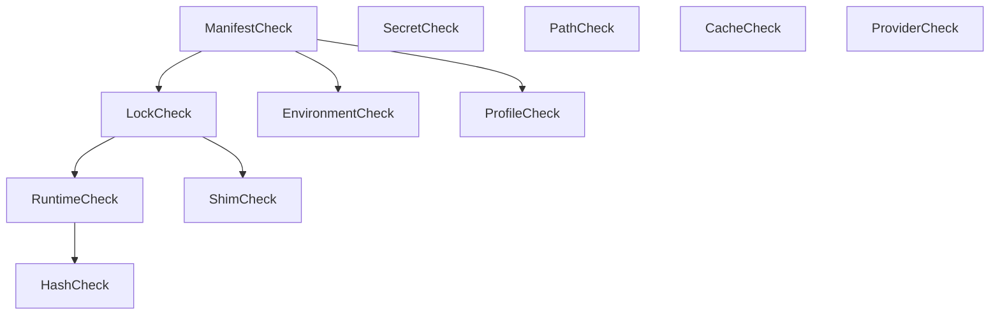

# Design: Forge Diagnostic Engine

## Technical Approach
Implement a parallelized DAG-based diagnostic engine using `tokio` to execute 11 concurrent checks. The engine calculates a consolidated health score, filters findings to prevent secret leaks, and delegates recovery options to a decoupled `RepairPlanner`.

## Architecture Decisions

| Option | Tradeoff | Decision |
|--------|----------|----------|
| **Tokio DAG Runner** | Async overhead vs parallel speed | Use tokio tasks with dependency graph resolving. Channels propagate completion status. |
| **Decoupled Repair Planner** | Extra mapper structs vs loose coupling | Use pure enum `QuickFixAction` returned by checks. A decoupled `RepairPlanner` maps them to executable actions. |
| **Serializer Masking** | Custom serializer vs inline filtering | Implement a custom `Serialize` implementation on `Finding`/`DiagnosticReport` to guarantee all sensitive credentials / env values are replaced with `[MASKED]`. |

## Data Flow



## File Changes

| File | Action | Description |
|------|--------|-------------|
| `crates/forge-core/src/diagnostics/mod.rs` | Create | Traits, types, concrete checks, and `DiagnosticEngine`. |
| `crates/forge-core/src/lib.rs` | Modify | Export `diagnostics` module and domain models. |
| `crates/forge-core/src/operations/mod.rs` | Modify | Re-route `RepairOperation` to use the new `RepairPlanner`. |
| `crates/forge-cli/src/main.rs` | Modify | Route CLI subcommands (`doctor`, `ai doctor`) to the new diagnostics framework. |

## Interfaces / Contracts

```rust
pub struct DiagnosticContext {
    pub workspace_root: std::path::PathBuf,
    pub cache_dir: std::path::PathBuf,
    pub mode: DiagnosticMode,
    pub active_profile: Option<String>,
}

#[derive(Debug, Clone, Copy, PartialEq, Eq, Serialize, Deserialize)]
pub enum DiagnosticMode { Fast, Deep }

#[async_trait::async_trait]
pub trait HealthCheck: Send + Sync {
    fn id(&self) -> &'static str;
    fn name(&self) -> &'static str;
    fn description(&self) -> &'static str;
    fn category(&self) -> &'static str;
    fn dependencies(&self) -> Vec<&'static str> { Vec::new() }
    async fn check(&self, ctx: &DiagnosticContext) -> Result<Vec<Finding>, String>;
}

#[derive(Debug, Clone, Serialize, Deserialize)]
pub struct Finding {
    pub code: String,              // e.g. "FG001"
    pub category: String,
    pub severity: Severity,
    pub confidence: u8,            // 0-100
    pub message: String,
    pub explanation: Explanation,
    pub suggested_quick_fix: Option<QuickFix>,
    pub doc_url: Option<String>,
}

#[derive(Debug, Clone, Copy, PartialEq, Eq, PartialOrd, Ord, Serialize, Deserialize)]
pub enum Severity { INFO, WARNING, ERROR, CRITICAL }

#[derive(Debug, Clone, Serialize, Deserialize)]
pub struct Explanation { pub what: String, pub why: String, pub how: String }

#[derive(Debug, Clone, Serialize, Deserialize)]
pub struct QuickFix { pub description: String, pub action: QuickFixAction }

#[derive(Debug, Clone, Serialize, Deserialize)]
pub enum QuickFixAction {
    WipeAndReextract { runtime_name: String, version: String },
    RecreateShim { shim_name: String },
    SetEnvVar { key: String, value: String },
    SetSecret { key: String },
    RegenerateLockfile,
    RegenerateShimsCache,
    AddToGitIgnore { path: String },
}

#[derive(Debug, Clone, Serialize, Deserialize)]
pub struct DiagnosticReport {
    pub timestamp: String,
    pub mode: DiagnosticMode,
    pub health_score: u8,
    pub findings: Vec<Finding>,
    pub elapsed_ms: u64,
}
```

## The 11 Concrete Checks

1. **ManifestCheck** (`FG001`/`FG002`): Reads `forge.toml`. Critical error aborts downstream lock, runtime, environment, profile, and shim checks.
2. **LockCheck** (`FG003`/`FG004`): Parses `forge.lock`. Outdated warning or missing error. Depends on ManifestCheck.
3. **RuntimeCheck** (`FG005`/`FG006`): Verifies runtime extraction folders. Depends on LockCheck.
4. **HashCheck** (`FG007`): Computes and compares archive SHA-256 for all runtimes during `Deep` mode. Skipped in `Fast` mode. Depends on RuntimeCheck.
5. **SecretCheck** (`FG008`): Validates format and connectivity of secrets/keyrings.
6. **EnvironmentCheck** (`FG009`): Resolves and validates environment profile variables. Depends on ManifestCheck.
7. **PathCheck** (`FG010`): Validates if shims directory is in system `$PATH`.
8. **ShimCheck** (`FG011`): Validates shim file layouts on disk. Depends on LockCheck.
9. **CacheCheck**: Checks cache disk usage.
10. **ProviderCheck**: Pings remote toolchain registries (Deep mode only).
11. **ProfileCheck**: Validates active profiles inside `forge.toml`. Depends on ManifestCheck.

## Concurrency & Short-Circuit Logic
The `DiagnosticEngine` maps checks to a dependency graph. Downstream checks execute as soon as all dependency tasks successfully complete without CRITICAL or blocking errors. If an upstream dependency fails (e.g., ManifestCheck returns CRITICAL), dependent nodes are immediately flagged as `Skipped` with a warning indicating the upstream blocker, preventing cascade failures.

## HealthScore Math
Starts at `100`. Deduct `30` per `CRITICAL`, `15` per `ERROR`, and `5` per `WARNING` finding. Capped at `[0, 100]`. If any `CRITICAL` finding exists, the score is capped at `40` max.

## Repair Planner & Execution
`RepairPlanner::plan(report: &DiagnosticReport) -> RepairPlan` maps findings containing `QuickFixAction` to a list of sequential, human-readable commands or transactional operations. Execution runs inside `RepairOperation` with transaction rollbacks. Dry-runs output the planner's proposed `RepairPlan` without executing.

## CLI & AI Doctor (Zero Secret Leakage)
The CLI exposes `forge doctor [--deep] [--json]` and `forge ai doctor`.
Zero secret leakage is enforced by:
1. `forge ai doctor` invokes serialization on the report.
2. The custom `Serialize` implementation for `QuickFixAction` or `Finding` checks any secrets or env values (e.g., in `SetEnvVar`) and replaces values with `"[MASKED]"`:
```rust
impl serde::Serialize for QuickFixAction {
    fn serialize<S>(&self, serializer: S) -> Result<S::Ok, S::Error>
    where S: serde::Serializer {
        // Match SetEnvVar and set value to "[MASKED]"
    }
}
```

## Testing Strategy
- **Unit**: Verify HealthScore calculations, Tokio DAG scheduler order/short-circuits, and `[MASKED]` JSON serializer logic.
- **Integration**: Validate `forge doctor` outputs, execution of dry-runs, and exit status matching.
