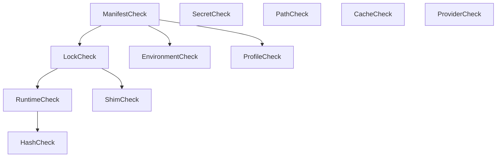

## Exploration: forge-diagnostic-engine

### Current State
Today, `forge` has basic diagnostic capabilities scattered across CLI modules. The `forge doctor` command performs simple, sequential checks:
- Verifies if the shims directory (`~/.forge/bin`) is in the system `$PATH`.
- Performs quick validation of runtimes declared in `forge.toml` (checks for existence of the extraction folder and whether it's empty).
- Validates environment variable definitions in `environment.rs` using a legacy `DoctorIssue` struct, returning a string-based error output if critical validation fails.

There is no structured concurrency, no formal severity hierarchy, no distinct execution modes (fast vs. deep), no automated mapping to repair operations, and no schema-guaranteed secret masking for AI integration.

### Affected Areas
- `crates/forge-core/src/lib.rs` — Needs to export the new `diagnostics` module containing traits, models, and engine logic.
- `crates/forge-core/src/diagnostics/mod.rs` — New module containing `HealthCheck` trait, `DiagnosticEngine`, `Finding` models, and execution routines.
- `crates/forge-core/src/operations/mod.rs` — Integration of `RepairPlanner` mapping findings to `RepairPlan` actions.
- `crates/forge-cli/src/main.rs` — Adapt `Commands::Doctor` and `Commands::Ai { subcommand: AiCommands::Doctor }` to leverage the new engine.

### Approaches

1. **Option A: Sequential & Synchronous Engine with Inline Logic**
   - *Description*: Simple engine running checks one after another on a single thread. Repair logic is handled via manually written CLI glue.
   - *Pros*: Simple implementation, no tokio orchestration overhead.
   - *Cons*: Heavy checks (like SHA-256 validation or network checks) block the thread; no separation of concerns between diagnostics and repairs; high risk of duplicate/cascade failures.
   - *Effort*: Low

2. **Option B: Concurrency DAG Engine with Clean Diagnostic/Repair Mapping (Recommended)**
   - *Description*: Runs 11 partitioned checks concurrently using `tokio::spawn`. Declares inter-check dependencies to short-circuit downstream checks (e.g. skipping SHA verification if `forge.lock` is missing). Maps findings directly to a `RepairPlanner` using structured `QuickFix` actions.
   - *Pros*: Highly performant, robust dependency resolution, zero filesystem re-scans for repair, clear separation of concerns, and built-in safety for AI commands.
   - *Cons*: Slightly higher implementation complexity for concurrency mapping.
   - *Effort*: Medium

### Recommendation
I recommend **Option B**. It provides a robust, fast execution model that scales well as more toolchains and providers are added. Short-circuiting execution prevents cascaded warning storms, and the clean decoupling of `DiagnosticReport` from the `RepairPlanner` ensures that dry-runs, CLI UI rendering, and AI remediations can use exactly the same models without re-inspecting disk state.

---

### Risks
- **Concurrency Overload**: Spawning too many high-IO checks concurrently on slower drives could cause resource contention. Remediation: limit the concurrency block sizes or utilize disk-bound execution queues.
- **Secret Leakage**: Masking must be absolute. Any print of environment variables or secrets must use `SecretProvider` masking APIs or boolean presence flags rather than raw string representations.

---

### Ready for Proposal
**Yes** — The orchestrator should proceed to define the proposal/specs for Phase 7 based on the attached RFC draft.

---

## Appendix: RFC-0013 Draft (Diagnostic Platform Specification)

### 1. Engine Architecture
The diagnostic platform resides in `crates/forge-core/src/diagnostics/mod.rs` and is driven by the `HealthCheck` trait and the `DiagnosticEngine`.

```rust
use async_trait::async_trait;
use std::collections::HashMap;
use std::path::PathBuf;
use serde::{Serialize, Deserialize};

#[derive(Debug, Clone)]
pub struct DiagnosticContext {
    pub workspace_root: PathBuf,
    pub cache_dir: PathBuf,
    pub mode: DiagnosticMode,
    pub active_profile: Option<String>,
}

#[derive(Debug, Clone, Copy, PartialEq, Eq, Serialize, Deserialize)]
pub enum DiagnosticMode {
    Fast,
    Deep,
}

#[async_trait]
pub trait HealthCheck: Send + Sync {
    /// Unique identifier for the check (e.g. "manifest", "lock", "hash")
    fn id(&self) -> &'static str;
    
    /// User-friendly name
    fn name(&self) -> &'static str;
    
    /// Summary description of what is checked
    fn description(&self) -> &'static str;
    
    /// Target category (e.g., "runtimes", "secrets", "shims")
    fn category(&self) -> &'static str;
    
    /// Check IDs that MUST execute and succeed before this check runs
    fn dependencies(&self) -> Vec<&'static str> {
        Vec::new()
    }
    
    /// Execute the check
    async fn check(&self, ctx: &DiagnosticContext) -> Result<Vec<Finding>, String>;
}

pub struct DiagnosticEngine {
    checks: Vec<Box<dyn HealthCheck>>,
}

impl DiagnosticEngine {
    pub fn new() -> Self {
        Self { checks: Vec::new() }
    }
    
    pub fn register(&mut self, check: Box<dyn HealthCheck>) {
        self.checks.push(check);
    }
    
    /// Build DAG and execute checks concurrently via tokio
    pub async fn run(&self, ctx: &DiagnosticContext) -> DiagnosticReport {
        // Implementation details described in Section 3
        todo!()
    }
}
```

### 2. Finding & Severity Model
A `Finding` represents a single issue discovered by a `HealthCheck`.

```rust
#[derive(Debug, Clone, Serialize, Deserialize)]
pub struct Finding {
    pub code: String,              // e.g. "FG001", "FG002"
    pub category: String,          // e.g. "runtime", "secrets", "env"
    pub severity: Severity,        // INFO, WARNING, ERROR, CRITICAL
    pub confidence: u8,            // 0 - 100%
    pub message: String,           // Human-readable issue summary
    pub explanation: Explanation,  // Structured what/why/how explanation
    pub suggested_quick_fix: Option<QuickFix>,
    pub doc_url: Option<String>,
}

#[derive(Debug, Clone, Copy, PartialEq, Eq, PartialOrd, Ord, Serialize, Deserialize)]
pub enum Severity {
    INFO,
    WARNING,
    ERROR,
    CRITICAL,
}

#[derive(Debug, Clone, Serialize, Deserialize)]
pub struct Explanation {
    pub what: String, // What was detected (contextual details)
    pub why: String,  // Why it impacts the system
    pub how: String,  // Recommended action (manual remediation)
}

#[derive(Debug, Clone, Serialize, Deserialize)]
pub struct QuickFix {
    pub description: String,
    pub action: QuickFixAction,
}

#[derive(Debug, Clone, Serialize, Deserialize)]
pub enum QuickFixAction {
    WipeAndReextract { runtime_name: String, version: String },
    RecreateShim { shim_name: String },
    SetEnvVar { key: String, value: String },
    SetSecret { key: String },
    RegenerateLockfile,
    RegenerateShimsCache,
    AddToGitIgnore { path: String },
}
```

#### Diagnostic Codes Matrix

| Code | Name | Category | Base Severity | Short-circuit Cause |
|---|---|---|---|---|
| **FG001** | Missing Manifest | manifest | CRITICAL | Aborts lock, hash, runtime, shim checks |
| **FG002** | Invalid Manifest Syntax | manifest | ERROR | Aborts lock, hash, runtime checks |
| **FG003** | Missing Lockfile | lock | ERROR | Aborts hash, runtime checks |
| **FG004** | Outdated Lockfile | lock | WARNING | None |
| **FG005** | Missing Runtime Extracted | runtime | ERROR | Aborts hash checks for this runtime |
| **FG006** | Runtime Execution Failure | runtime | CRITICAL | None |
| **FG007** | Invalid File Hash | hash | CRITICAL | None |
| **FG008** | Secret Format Violation | secrets | ERROR | None |
| **FG009** | Missing Mandatory Env Var | env | ERROR | None |
| **FG010** | Missing Shim Directory | path | WARNING | None |
| **FG011** | Corrupt Shim Cache | shim | ERROR | None |

---

### 3. Parallel Execution & Dependency Short-Circuiting
The 11 checks are organized as a Directed Acyclic Graph (DAG) based on their declared `dependencies()`.

#### The 11 Diagnostic Checks
1. **ManifestCheck** (`manifest`): Reads `forge.toml`.
2. **LockCheck** (`lock`): Reads `forge.lock`. Depends on `manifest`.
3. **RuntimeCheck** (`runtime`): Checks runtime extraction folders. Depends on `lock`.
4. **SecretCheck** (`secrets`): Validates secret format/connectivity. No dependencies.
5. **EnvironmentCheck** (`env`): Validates environment profile variables. Depends on `manifest`.
6. **PathCheck** (`path`): Validates if shims directory is in system `$PATH`. No dependencies.
7. **ShimCheck** (`shim`): Validates shims mapping. Depends on `lock`.
8. **HashCheck** (`hash`): Checks SHA-256 of extracted archives. Depends on `runtime`.
9. **CacheCheck** (`cache`): Checks size and status of cache storage. No dependencies.
10. **ProviderCheck** (`provider`): Checks if remote providers are reachable. No dependencies.
11. **ProfileCheck** (`profile`): Validates active workspace profiles. Depends on `manifest`.

#### Concurrency Runner Flow
Using `tokio::sync::broadcast` or state maps protected by `Arc<Mutex>`:
- The engine computes a dependency resolution list.
- Tasks with 0 unresolved dependencies are spawned immediately via `tokio::spawn`.
- When a task completes:
  - If it succeeds and has no findings of level `CRITICAL`, dependent tasks are decremented and launched.
  - If a task yields a blocking finding (e.g. `LockCheck` determines `forge.lock` is missing), the engine marks all dependent tasks (`HashCheck`, `RuntimeCheck`) as **Skipped** with a finding indicating the upstream blocker.



---

### 4. Diagnostics vs Repair Planner Mapping
Coupling between diagnostic findings and restoration steps is kept clean by defining `QuickFixAction` as a pure enum. 

```rust
pub struct RepairPlanner;

impl RepairPlanner {
    pub fn plan(report: &DiagnosticReport) -> RepairPlan {
        let mut broken_runtimes = Vec::new();
        let mut actions = Vec::new();
        
        for finding in &report.findings {
            if let Some(ref quick_fix) = finding.suggested_quick_fix {
                match &quick_fix.action {
                    QuickFixAction::WipeAndReextract { runtime_name, version } => {
                        broken_runtimes.push(runtime_name.clone());
                        actions.push(format!("Re-extract {} v{}", runtime_name, version));
                    }
                    QuickFixAction::RecreateShim { shim_name } => {
                        actions.push(format!("Restore shim binary for {}", shim_name));
                    }
                    QuickFixAction::RegenerateShimsCache => {
                        actions.push("Regenerate shims cache".to_string());
                    }
                    QuickFixAction::AddToGitIgnore { path } => {
                        actions.push(format!("Append {} to .gitignore", path));
                    }
                    // Map other actions...
                    _ => {}
                }
            }
        }
        
        RepairPlan {
            broken_runtimes,
            actions,
        }
    }
}
```

This ensures that the repair system is built on top of the diagnostics layer, making dry-runs trivial (we just list the actions from the planner without executing them).

---

### 5. Execution Modes (Fast vs Deep)
To optimize CLI performance, checks check their target context's `mode` parameter:

- **`DiagnosticMode::Fast`**
  - Skip hash verification (SHA-256 file reads).
  - Skip remote toolchain/registry availability checks over HTTPS.
  - Skip running sandboxed sub-processes (e.g. running `node --version`).
  - Limit checks to path presence, manifest parsing, directory existence, and environment presence.
- **`DiagnosticMode::Deep`**
  - Calculate SHA-256 of extracted runtimes.
  - Run full validation commands inside shims to guarantee binaries execute successfully.
  - Execute secret provider checkouts and active health pings to external registries.

---

### 6. Structured Output & HealthScore
The structured output model maps to the `forge ai doctor` JSON API.

#### HealthScore Calculation
The health score is represented as an integer in the range `[0, 100]`.
- Start score = `100`.
- Deductions:
  - Each `Severity::CRITICAL` finding deducts `30` points.
  - Each `Severity::ERROR` finding deducts `15` points.
  - Each `Severity::WARNING` finding deducts `5` points.
  - Each `Severity::INFO` finding deducts `0` points.
- **Guards**:
  - The final score is clamped to `[0, 100]`.
  - If there is **at least one** `Severity::CRITICAL` finding, the score is capped at `40` maximum.

#### Diagnostic Report Structure
```rust
#[derive(Debug, Clone, Serialize, Deserialize)]
pub struct DiagnosticReport {
    pub timestamp: String,
    pub mode: DiagnosticMode,
    pub health_score: u8,
    pub findings: Vec<Finding>,
    pub elapsed_ms: u64,
}
```

#### Plaintext Secret Leakage Safeguard Schema
To avoid exposing sensitive environment secrets when output is fed to LLMs, findings regarding secrets/environments **MUST** mask the payload.

```json
{
  "$schema": "http://json-schema.org/draft-07/schema#",
  "title": "DiagnosticReport",
  "type": "OBJECT",
  "required": ["timestamp", "mode", "health_score", "findings", "elapsed_ms"],
  "properties": {
    "timestamp": { "type": "STRING" },
    "mode": { "type": "STRING", "enum": ["Fast", "Deep"] },
    "health_score": { "type": "INTEGER", "minimum": 0, "maximum": 100 },
    "elapsed_ms": { "type": "INTEGER" },
    "findings": {
      "type": "ARRAY",
      "items": {
        "type": "OBJECT",
        "required": ["code", "category", "severity", "confidence", "message", "explanation"],
        "properties": {
          "code": { "type": "STRING" },
          "category": { "type": "STRING" },
          "severity": { "type": "STRING", "enum": ["INFO", "WARNING", "ERROR", "CRITICAL"] },
          "confidence": { "type": "INTEGER", "minimum": 0, "maximum": 100 },
          "message": { "type": "STRING" },
          "explanation": {
            "type": "OBJECT",
            "required": ["what", "why", "how"],
            "properties": {
              "what": { "type": "STRING" },
              "why": { "type": "STRING" },
              "how": { "type": "STRING" }
            }
          },
          "suggested_quick_fix": {
            "type": "OBJECT",
            "required": ["description", "action"],
            "properties": {
              "description": { "type": "STRING" },
              "action": {
                "type": "OBJECT",
                "properties": {
                  "WipeAndReextract": {
                    "type": "OBJECT",
                    "required": ["runtime_name", "version"],
                    "properties": {
                      "runtime_name": { "type": "STRING" },
                      "version": { "type": "STRING" }
                    }
                  },
                  "RecreateShim": {
                    "type": "OBJECT",
                    "required": ["shim_name"],
                    "properties": {
                      "shim_name": { "type": "STRING" }
                    }
                  },
                  "SetEnvVar": {
                    "type": "OBJECT",
                    "required": ["key", "value"],
                    "properties": {
                      "key": { "type": "STRING" },
                      "value": { "type": "STRING", "description": "Must be masked/empty" }
                    }
                  },
                  "SetSecret": {
                    "type": "OBJECT",
                    "required": ["key"],
                    "properties": {
                      "key": { "type": "STRING" }
                    }
                  }
                }
              }
            }
          },
          "doc_url": { "type": "STRING" }
        }
      }
    }
  }
}
```

*Note: The `SetEnvVar` and any finding diagnostic data regarding variables must mask actual values (e.g. `value: "[MASKED]"` or `has_value: true`) and never include the raw plaintext secrets.*
