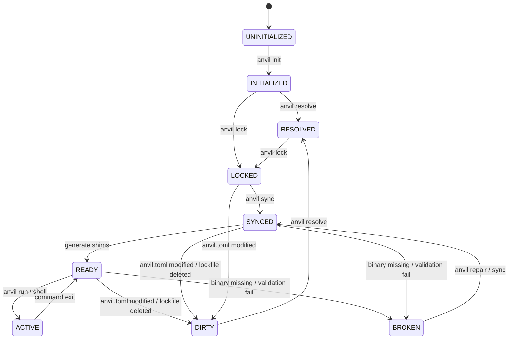

## Exploration: forge-environment-lifecycle

### Current State
Currently, the `forge` CLI manages runtimes using direct command flows (like `Lock`, `Run`, `Shell`, `Setup`, `Doctor`, `Which`, `Init`). While functional, these commands are tightly coupled in `anvil-cli` and `anvil-core`. The lifecycle of the environment is implicit and lacks a defined state machine, event reporting, transaction rollback, and a clean separation between CLI rendering and core orchestration business logic. This makes it difficult for AI agents to precisely inspect the lifecycle state, catch partial failures, or trace installation progress.

---

### Affected Areas
- `openspec/changes/forge-environment-lifecycle/exploration.md` — This exploration file documenting the design decisions.
- `crates/anvil-core/src/lib.rs` — Re-exporting the new operations, event system, and lifecycle status interfaces.
- `crates/anvil-core/src/types.rs` — Defining the new `LifecycleState` enum, `Event` enum, and operation-related metadata.
- `crates/anvil-core/src/environment.rs` — Adding lifecycle inspection and validation helper functions.
- `crates/anvil-cli/src/main.rs` — Redesigning the CLI commands to utilize the operation traits and the decoupled event bus.

---

### Approaches

#### Approach 1: Command-centric Execution with In-Place File Operations
Keep commands as independent functions inside `anvil-core` and implement the lifecycle state checks dynamically on every invocation. Runtimes are downloaded and extracted directly into their final destination paths, using cleanup guards to delete folders in case of failures.
- **Pros:**
  - Simpler code structure.
  - Less refactoring of the current installer structure.
- **Cons:**
  - Lacks atomicity; a network failure mid-install leaves the environment in an invalid state.
  - Hard to build progress event telemetry for external monitoring or IDE plugins.
  - High risk of race conditions if multiple commands run concurrently.
- **Effort:** Medium

#### Approach 2: Operations Layer with Transactional Staging, Event Bus, and State Machine (Recommended)
Refactor `anvil-core` to introduce an `Operation` trait pattern separating orchestration logic from CLI. Implement a formal state machine (RFC-0011), a lightweight event bus, and a transactional installation runner using staging directories to ensure atomic rollbacks.
- **Pros:**
  - 100% atomic installations: environment remains clean and stable even under network or disk failures.
  - Telemetry-friendly: event bus allows the CLI to draw progress bars while an agent traces progress via JSON streams.
  - Robust state machine: clean transition guards prevent running code in dirty, outdated, or broken environments.
- **Cons:**
  - Higher initial implementation complexity.
  - Performance overhead of renaming and staging folders (negated by using same-drive renames).
- **Effort:** High

---

### Detailed Design Exploration

#### 1. Environment Lifecycle (RFC-0011) Machine States
RFC-0011 defines ten machine states for a `forge` workspace. The system determines the current state dynamically by inspecting the manifest (`anvil.toml`), lockfile (`anvil.lock`), shims cache (`.anvil/shims.cache`), and the local runtime installations in the cache directory (`~/.anvil/runtimes`).



| Lifecycle State | Description / State Invariants | Transition Guards / File Mutation Triggers |
| :--- | :--- | :--- |
| **UNINITIALIZED** | `anvil.toml` is not present in the current workspace directory or any parent. | **Guard:** Exits when `anvil init` creates `anvil.toml`. |
| **INITIALIZED** | `anvil.toml` is present, but `anvil.lock` does not exist in the workspace. | **Guard:** Transitions to `RESOLVED` on resolution, or `LOCKED` when `anvil.lock` is written. |
| **RESOLVED** | Runtimes resolved to matching registry releases (in-memory or local metadata cache). | **Guard:** Transitions to `LOCKED` once the resolved configurations are written to `anvil.lock`. |
| **LOCKED** | `anvil.lock` exists and is structurally valid, but required runtimes are not fully installed. | **Guard:** Transitions to `SYNCED` once all locks match hashes and extract targets. **Mutation:** Moves to `DIRTY` if `anvil.toml` is edited. |
| **SYNCED** | All runtimes in `anvil.lock` are downloaded, verified (SHA-256), and extracted to the cache. | **Guard:** Transitions to `READY` when `.anvil/shims.cache` is generated. **Mutation:** Moves to `DIRTY` if `anvil.lock` is deleted. |
| **READY** | `.anvil/shims.cache` is valid and matches the installed runtimes. Shims are set up. | **Guard:** Transitions to `ACTIVE` when `run` or `shell` executes. **Mutation:** Moves to `BROKEN` if target binaries are deleted. |
| **ACTIVE** | A subprocess (command or shell) is executing inside the isolated env container. | **Guard:** Transitions back to `READY` when the subprocess exits. |
| **DIRTY** | The declared runtimes in `anvil.toml` no longer match the entries in `anvil.lock`. | **Guard:** Transitions to `RESOLVED`/`LOCKED` via `anvil lock` or `anvil up`. |
| **OUTDATED** | The local files match `anvil.lock`, but registry has newer releases matching `anvil.toml`. | **Guard:** Transitions to `RESOLVED` via checking update registry. |
| **BROKEN** | A target directory exists but is corrupted (missing main executable, failing checksums). | **Guard:** Transitions to `SYNCED` or `READY` via `anvil repair` or `anvil sync`. |

---

#### 2. Operations Layer Architecture
To separate the execution logic from the CLI rendering and interface, all core logic is encapsulated inside `Operation` structs within `anvil-core`. The CLI or external agents configure the operation and call `execute`.

```rust
use async_trait::async_trait;
use std::path::PathBuf;

pub struct OperationContext {
    pub workspace_dir: PathBuf,
    pub cache_dir: PathBuf,
    pub platform: Platform,
    pub arch: Architecture,
}

#[async_trait]
pub trait Operation {
    type Output;
    type Error;

    async fn execute<E>(&self, ctx: &OperationContext, event_sender: &E) -> Result<Self::Output, Self::Error>
    where
        E: EventSender + Sync + Send;
}
```

##### Core Operations Mapping:
1. **`ResolveOperation`**: Parses `anvil.toml`, queries registries, and builds a list of `RuntimeLock` definitions.
2. **`LockOperation`**: Executes `ResolveOperation` and writes the resulting lock definitions to `anvil.lock`.
3. **`SyncOperation`**: Iterates through `anvil.lock`, stage-downloads, stage-extracts, verifies, promotes runtimes, and regenerates `.anvil/shims.cache`.
4. **`CleanOperation`**: Removes specified local cached runtimes or completely wipes cache files and shims.
5. **`GcOperation`**: Cleans orphaned runtimes in the cache that are no longer referenced in the locks of registered local workspaces.
6. **`RunOperation`**: Checks if state is `READY` (syncing if not), sets up process environment maps, and executes a command.
7. **`RepairOperation`**: Performs full structural and checksum validation of all installed runtimes, triggering re-downloads for damaged directories.
8. **`PlanOperation`**: Simulates a sync, generating a plan struct showing `Add`, `Remove`, `Update`, or `Reinstall` actions.

---

#### 3. Event Bus Design
A decoupled, lightweight Event Bus provides progress notifications to UI indicators (like progress bars) and tracing tools without coupling `anvil-core` to terminal rendering libraries.

```rust
#[derive(Debug, Clone, serde::Serialize)]
pub enum Event {
    // Operation level
    OperationStarted { op: String },
    OperationCompleted { op: String, success: bool },
    
    // Resolve events
    ResolvingRuntime { name: String, version_req: String },
    ResolvedRuntime { name: String, version: String },

    // Download/Extract events
    SyncStarted { runtimes: Vec<(String, String)> },
    DownloadStarted { runtime: String, url: String, total_bytes: Option<u64> },
    DownloadProgress { runtime: String, bytes_downloaded: u64, total_bytes: Option<u64> },
    DownloadCompleted { runtime: String },
    ExtractionStarted { runtime: String },
    ExtractionCompleted { runtime: String },
    VerificationStarted { runtime: String },
    VerificationCompleted { runtime: String, sha256: String },

    // Shim events
    ShimsCacheRegenerated { shim_count: usize },
    
    // Warnings / Errors
    Warning { message: String },
}

pub trait EventSender {
    fn send(&self, event: Event);
}

// In-CLI Broadcast Channel wrapper:
pub struct BroadcastEventBus {
    tx: tokio::sync::broadcast::Sender<Event>,
}
```
Consumers can subscribe to this bus. For example, `anvil-cli` will listen to progress events to update concurrent `indicatif` progress bars, while AI tracing configurations will serialize events directly into a JSON line stream for real-time observability.

---

#### 4. Transactional Executions & Atomic Rollbacks
To prevent corruption when installing runtimes, all download and extraction processes use a staged-to-commit model.

```
[Staging Phase]
Download/Extract -> cache/runtimes/.staging/{runtime}/{version}
                         |
                 (Verify integrity)
                         |
[Promotion Phase]
Rename original -> cache/runtimes/.backup/{runtime}/{version}
Rename staged   -> cache/runtimes/{runtime}/{version}
                         |
                (Validation Success)
                         |
               Clean up .backup/ folders
```

##### Rollback Rules:
1. **Download & Extract**: Runtimes are downloaded and extracted to `~/.anvil/runtimes/.staging/{runtime}/{version}`.
2. **Checksum & Executable Verification**: We verify the extracted contents. If any runtime fails verification or fails during download, we trigger the rollback.
3. **Rollback Execution**:
   - Terminate all other concurrent downloads and extractions in the batch.
   - Delete all staged directories in `.staging` associated with the current batch.
   - Restore original runtime directories from `.backup` (if we were upgrading/repairing existing runtimes).
   - Clear `.backup` directory and exit with a clean failure state.
4. **Promotion**: If and only if all batch operations succeed, we delete `.backup` directories and mark the sync as completed.

---

#### 5. Command Line Interface Redesign Spec

Every command will support `--json` for machine readability.

*   `anvil init`
    *   **Behavior**: Creates `anvil.toml` if missing, appends `.anvil/shims.cache` and `.anvil/state.json` to `.gitignore`.
    *   **Exit Code**: `0` on success, `1` on write error.
*   `anvil resolve`
    *   **Behavior**: Performs dry-run resolution of `anvil.toml` runtimes against hybrid registry. Prints version details.
    *   **Exit Code**: `0` on successful resolution, `1` if version reqs are unsatisfied.
*   `anvil lock`
    *   **Behavior**: Executes `ResolveOperation` and writes `anvil.lock` to workspace.
    *   **Exit Code**: `0` on success, `1` on resolution/write failure.
*   `anvil sync`
    *   **Behavior**: Reads `anvil.lock` and executes transactional installation of all missing runtimes in parallel.
    *   **Exit Code**: `0` on success, `1` on atomic failure (rollback is executed).
*   `anvil up`
    *   **Behavior**: Chains `resolve` -> `lock` -> `sync` in a single command.
*   `anvil run <cmd> [args]...`
    *   **Behavior**: Verifies environment state. Spawns child command with local path prepended to `PATH` and `anvil.env` variables injected.
*   `anvil shell`
    *   **Behavior**: Spawns system's default shell (bash/zsh/powershell/cmd) inside the activated runtime context.
*   `anvil clean [--runtime <name>] [--all]`
    *   **Behavior**: Deletes cached binaries and shims. If `--all`, clears the entire runtimes cache.
*   `anvil gc`
    *   **Behavior**: Scans local workspaces register (stored in `~/.anvil/workspaces.json`) and garbage collects unused versions.
*   `anvil status`
    *   **Behavior**: Evaluates workspace against state machine invariants. Prints active state (READY, DIRTY, BROKEN) and details.
*   `anvil inspect`
    *   **Behavior**: Prints JSON describing active environment paths, environment variables (masked), registry source, and shim mappings.
*   `anvil repair`
    *   **Behavior**: Forces SHA-256 validation of all locked runtimes, re-installing any corrupted files via transactional sync.
*   `anvil plan`
    *   **Behavior**: Calculates diff between `anvil.toml`, `anvil.lock`, and current cache, outputting planned installs/removals.

---

### Draft Skeleton for RFC-0011

We will draft the RFC-0011 design skeleton here to be included in the change documentation:

```markdown
# RFC-0011: Environment Lifecycle Management

## Status: Draft
## Date: 2026-07-01
## Author: Anvil Team

### 1. Motivation
Currently, environment management in `forge` is command-driven rather than state-driven. This leads to partial failure states (e.g. half-extracted runtimes) and lack of coordination between configuration changes and shell executions. We need a formal state machine and transactional layer to guarantee consistency.

### 2. State Machine Specification
The active workspace state is determined dynamically by evaluating the existence and checksum matches of `anvil.toml`, `anvil.lock`, `.anvil/shims.cache`, and cached binary runtimes.
- States: `UNINITIALIZED`, `INITIALIZED`, `RESOLVED`, `LOCKED`, `SYNCED`, `READY`, `ACTIVE`, `DIRTY`, `OUTDATED`, `BROKEN`.
- Evaluated on every `anvil status` and before executing `anvil run`/`shell`.

### 3. Operations Layer
To allow scripting, testing, and AI-agent automation, core business logic is moved into `crates/anvil-core/src/operations/` and exposed via the `Operation` trait. Terminal UI (progress bars, colors) lives entirely in the CLI crate, listening to the core engine via the `EventBus`.

### 4. Transactional Installations
To prevent corrupted workspaces:
- Installers must download and extract to `.staging/`.
- Directory transitions (promotion) from `.staging/` to the main cache folder must be atomic.
- Existing directory overrides must back up to `.backup/` first, allowing automatic rollbacks in case of any runtime install failure.

### 5. Backward Compatibility & Migrations
- The structure of `anvil.toml` remains unchanged.
- Existing `.anvil/shims.cache` files will be automatically regenerated during the first `anvil status` or `anvil run` run.
```

---

### Recommendation
**Approach 2 (Decoupled Operations + Transactional Staging + State Machine)** is the recommended path.
- **Rationale**: Building a robust state machine and atomic staging directory system prevents corrupted runtimes, which is a major point of friction for both developers and AI agents. Decoupling the CLI via the Event Bus allows for clean JSON tracing and telemetry.

---

### Risks
- **Atomic Rename Support**: Moving files across different drives is not atomic in standard filesystems. We must ensure staging directories are created within the same cache partition (`~/.anvil/runtimes/`) to guarantee simple, sub-millisecond directory renames.
- **FS Locking on Windows**: Windows aggressively locks open files, which can cause atomic renames to fail if a shim or terminal is active. We need retry policies and file-lock checks in the promotion phase.

---

### Ready for Proposal
**Yes**. The orchestrator should proceed to the `sdd-propose` phase to detail the precise Rust structures, API contracts, and implementation plan for RFC-0011.
