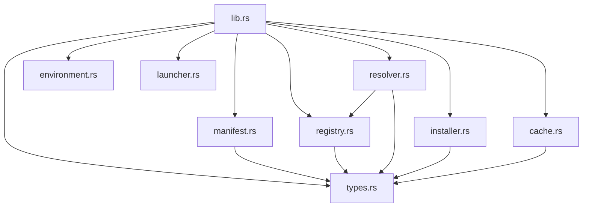

# Design: Modularize Forge Core Runtime Engine

## Technical Approach

Deconstruct the monolithic `crates/forge-core/src/lib.rs` into eight separate domain modules. Primitives are isolated in `types.rs` to prevent circular dependencies. An extensible, registration-based provider interface replaces hardcoded match structures in version resolution. Unit tests are nested within their respective modules, and cross-module integration tests are consolidated in a unified integration test suite.

## Architecture Decisions

| Option | Tradeoff | Decision |
|--------|----------|----------|
| Dynamic Provider Registration | Slightly more runtime state in `Resolver` | Implement `Resolver` with a dynamic `HashMap` map of `RuntimeProvider` trait objects. Decouples provider list from engine logic. |
| Consolidated Primitive Types | Overhead of additional module file `types.rs` | Move all enums/structs (`Platform`, `Architecture`, `Hash`, `EmulationLog`) to `types.rs`. Prevents circular sibling imports. |
| Inline `mod tests` | Bloats target files slightly | Relocate unit tests to the bottom of their respective modules. Standard Rust idiomatic layout. |

## Dependency Hierarchy



Sibling coupling is restricted:
- `resolver` only references `types` and `registry`.
- `registry` and `manifest` only reference `types`.
- `installer` and `cache` only reference `types`.
- `environment` and `launcher` have zero sibling coupling.

## Data Flow

```
Manifest (toml) ──> ForgeConfig ──> Resolver (via Provider Map)
                                           │
                                           ▼
Lockfile (locks) <─────────────────── RuntimeLock
       │
       ▼
Installer ──> Downloader ──> Extractor ──> Toolchain Cache
                                                  │
                                                  ▼
Launcher <── Environment <── Bin Paths <── Shims Cache
```

## File Changes

| File | Action | Description |
|------|--------|-------------|
| `crates/forge-core/src/lib.rs` | Modify | Facade exposing modules and re-exporting stable interfaces (`Resolver`, `Installer`, `Manifest`, `Lockfile`, etc.). |
| `crates/forge-core/src/types.rs` | Create | Domain enums/structs: `RuntimeId`, `RuntimeVersion`, `Platform`, `Architecture`, `Hash`, `EmulationLog`, `RuntimeLock`. |
| `crates/forge-core/src/manifest.rs` | Create | Manifest loader: `ForgeConfig`, `find_forge_toml`, `load_config`. |
| `crates/forge-core/src/resolver.rs` | Create | Decoupled resolver engine: `Resolver` registry, `RuntimeProvider` trait, and provider structs (`Node`, `Python`, `Bun`, `Go`, `Rust`). |
| `crates/forge-core/src/installer.rs` | Create | Runtime installation: `Extractor` trait, `Zip`/`TarGz`/`TarXz` decompressors, `Downloader`, `check_path_traversal`, `install_runtimes`. |
| `crates/forge-core/src/registry.rs` | Create | Offline registry metadata: `HybridRegistry`, `RegistryEntry`, platform/architecture normalization and detection. |
| `crates/forge-core/src/cache.rs` | Create | Cache management: path helpers, shims map generation, signature/write helper, `.gitignore` sync. |
| `crates/forge-core/src/environment.rs` | Create | Environment builder: PATH calculation, `.env` file parsing, secret masking. |
| `crates/forge-core/src/launcher.rs` | Create | Execution: process spawning, Unix execvp/Windows forwarding, signal routing. |
| `crates/forge-core/tests/integration.rs` | Create | Unified integration tests. |

## Interfaces / Contracts

### `types.rs`
```rust
pub struct RuntimeId(pub String);
pub struct RuntimeVersion(pub String);
pub struct Hash(pub String);

#[derive(Debug, Copy, Clone, PartialEq, Eq, Hash, Serialize, Deserialize)]
pub enum Platform { Windows, Macos, Linux, Unknown }

#[derive(Debug, Copy, Clone, PartialEq, Eq, Hash, Serialize, Deserialize)]
pub enum Architecture { X86_64, Aarch64, Unknown }
```

### `resolver.rs`
```rust
pub trait RuntimeProvider: Send + Sync {
    fn name(&self) -> &str;
    fn resolve(&self, version_req: &str, platform: &str, arch: &str, registry: &HybridRegistry) -> Result<RuntimeLock, String>;
}

pub struct Resolver {
    providers: HashMap<String, Box<dyn RuntimeProvider>>,
}

impl Resolver {
    pub fn new() -> Self;
    pub fn register<P: RuntimeProvider + 'static>(&mut self, provider: P);
    pub fn resolve(&self, name: &str, version: &str, platform: &str, arch: &str, registry: &HybridRegistry) -> Result<RuntimeLock, String>;
}
```

## Testing Strategy

| Layer | What to Test | Approach |
|-------|-------------|----------|
| Unit | Module-specific functions (e.g. `is_secret`, `ZipSlip`, `semver` matching) | Internal `mod tests` block at the bottom of each source file. |
| Integration | Cross-module compatibility, downloads, extraction, environment builder and process spawning | Consolidated integration tests in `crates/forge-core/tests/integration.rs`. |

## Migration / Rollout

No migration required. Backward compatibility is preserved using `pub use` facade re-exports in `lib.rs`, ensuring downstream crates (`forge-cli` and `forge-shim`) compile cleanly without API changes.

## Open Questions

- None
