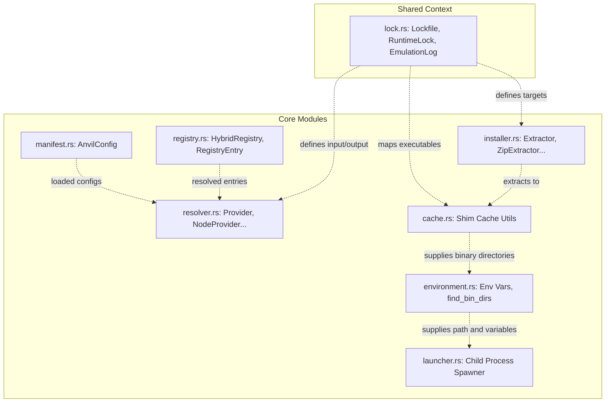

# Exploration: Modular Refactoring of the Runtime Engine

## Current State

The current runtime engine implementation is centralized entirely within `crates/anvil-core/src/lib.rs` (1,297 lines) and `crates/anvil-core/src/lock.rs` (106 lines). The single `lib.rs` file mixes:
- Manifest Loading & Parsing (`ForgeConfig`, `.env` parsing, secret masking).
- Runtime Coordinate Resolving (`Provider` trait, tool providers like node/python/bun/go/rust, semver constraints resolution).
- Downloader & Hashing (`download_runtime`, SHA256 validation).
- Extractor (`Extractor` trait, ZIP, TAR.GZ, TAR.XZ extractors, zip-slip path traversal guards).
- Execution & Process Launching (`run_command_in_env`, `spawn_shell_in_env`).
- Environment Context Building (`find_bin_dirs`, PATH configuration).
- Shims Cache Management (`shims.cache` map generation, signature computation, writing/updating cache file).
- Workspace Utilities (`.gitignore` update).
- Inline testing of all of the above.

This mixing of concerns makes code maintenance, testing, and extensions (like adding new providers or extraction formats) difficult and violates the single responsibility principle.

---

## Affected Areas

The modular refactoring will touch the files within the `anvil-core` and potentially `anvil-cli` crates:
- `crates/anvil-core/src/lib.rs` — Will be trimmed to declare submodules and re-export the public API for backward compatibility.
- `crates/anvil-core/src/resolver.rs` — New submodule for version mapping and lockfile generation.
- `crates/anvil-core/src/installer.rs` — New submodule for downloading, SHA-256 verification, and archive extraction.
- `crates/anvil-core/src/registry.rs` — New submodule for `HybridRegistry`, platform detection, and normalize helpers.
- `crates/anvil-core/src/cache.rs` — New submodule for directory state and shim.cache compilation.
- `crates/anvil-core/src/environment.rs` — New submodule for environment variables parsing, masking, and bin path detection.
- `crates/anvil-core/src/launcher.rs` — New submodule for child process spawning and execution.
- `crates/anvil-core/src/manifest.rs` — New submodule for `ForgeConfig` loading and checking.

---

## Submodule Architecture & Responsibilities

### 1. `manifest.rs` (Manifest & Configuration)
- **Role**: Loading configuration manifests.
- **Items**:
  - `ForgeConfig` (Struct)
  - `find_forge_toml(start_dir: &Path) -> Option<PathBuf>`
  - `load_config(toml_path: &Path) -> Result<ForgeConfig, String>`

### 2. `resolver.rs` (Runtime Resolver)
- **Role**: Maps version requests to registry definitions and orchestrates lockfile state without doing file mutations or network I/O.
- **Items**:
  - `Provider` (Trait)
  - `NodeProvider`, `PythonProvider`, `BunProvider`, `GoProvider`, `RustProvider` (Structs)
  - `get_providers() -> HashMap<String, Box<dyn Provider>>`
  - `resolve_runtime_lock(name: &str, version: &str) -> Result<RuntimeLock, String>`
  - `resolve_from_registry(...) -> Result<RuntimeLock, String>`
  - `update_lockfile(toml_path: &Path, lockfile_path: &Path) -> Result<Lockfile, String>`
  - *Tests*: `test_offline_version_matching`

### 3. `installer.rs` (Runtime Installer)
- **Role**: Pulls packages from remote URLs, validates signatures, extracts compressed runtimes, and manages filesystem transactional boundaries with cleanup guards.
- **Items**:
  - `download_runtime(lock: &RuntimeLock, cache_dir: &Path) -> Result<PathBuf, String>`
  - `install_runtimes(lockfile: &Lockfile, cache_dir: &Path) -> Result<(), String>`
  - `Extractor` (Trait)
  - `ZipExtractor`, `TarGzExtractor`, `TarXzExtractor` (Structs)
  - `extract_archive(archive_path: &Path, extract_to: &Path) -> Result<(), String>`
  - `compute_sha256(path: &Path) -> Result<String, String>`
  - `check_path_traversal(dest: &Path, entry_path: &Path) -> Result<PathBuf, String>`
  - `FileCleanupGuard`, `DirCleanupGuard` (Guards)
  - *Tests*: `test_download_sha_mismatch_and_deletion`, `test_standard_archives_extraction`, `test_zip_slip_prevention`, `test_parallel_download_and_abort`, plus helpers like `start_mock_server`.

### 4. `registry.rs` (Runtime Registry)
- **Role**: Models metadata compatibility tables (`RegistryEntry`, `HybridRegistry`) and resolves system platform metrics.
- **Items**:
  - `RegistryEntry` (Struct)
  - `HybridRegistry` (Struct and impl)
  - `detect_platform() -> &'static str`
  - `detect_arch() -> &'static str`
  - `normalize_platform(platform: &str) -> &str`
  - `normalize_arch(arch: &str) -> &str`

### 5. `cache.rs` (Runtime Cache)
- **Role**: Evaluates target directories for runtime reuse, manages/writes `shims.cache` signatures, and manages workspace ignore settings.
- **Items**:
  - `get_cache_dir() -> Result<PathBuf, String>`
  - `generate_shims_cache_map(lockfile: &Lockfile, cache_dir: &Path) -> HashMap<String, PathBuf>`
  - `write_shims_cache_file(cache_file_path: &Path, map: &HashMap<String, PathBuf>) -> Result<(), String>`
  - `regenerate_shims_cache(lockfile: &Lockfile, cache_dir: &Path) -> Result<(), String>`
  - `append_to_gitignore(workspace_dir: &Path) -> Result<(), String>`
  - *Tests*: `test_append_to_gitignore`, `test_shims_cache_serialization`

### 6. `environment.rs` (Environment Builder)
- **Role**: Parses workspace environmental states and filters directories.
- **Items**:
  - `find_bin_dirs(dir: &Path) -> Vec<PathBuf>`
  - `find_forge_env(start_dir: &Path) -> Option<PathBuf>`
  - `parse_env_file(path: &Path) -> Result<HashMap<String, String>, String>`
  - `is_secret(key: &str) -> bool`
  - `mask_env_vars(env_vars: &HashMap<String, String>) -> HashMap<String, String>`
  - *Tests*: `test_is_secret`, `test_mask_env_vars`

### 7. `launcher.rs` (Process Launcher)
- **Role**: Spawns children with combined environment contexts.
- **Items**:
  - `run_command_in_env(...) -> Result<i32, String>`
  - `spawn_shell_in_env(...) -> Result<i32, String>`

---

## Shared Traits and Data Structures Reorganization

The following dependencies exist between components:



### Visibility & Exposure
To ensure all existing code compiling against `anvil-core` continues to function:
1. `crates/anvil-core/src/lib.rs` will re-export all items using `pub use` statements.
2. In `lib.rs`:
   ```rust
   pub mod lock;
   pub mod manifest;
   pub mod resolver;
   pub mod installer;
   pub mod registry;
   pub mod cache;
   pub mod environment;
   pub mod launcher;

   pub use lock::*;
   pub use manifest::*;
   pub use resolver::*;
   pub use installer::*;
   pub use registry::*;
   pub use cache::*;
   pub use environment::*;
   pub use launcher::*;
   ```
3. Traits and structures like `Lockfile`, `RuntimeLock`, `Provider`, and `Extractor` will retain public (`pub`) status.

---

## Approaches

### Option A: Complete Inline Split
Separate the large `lib.rs` into new files and re-export them from `lib.rs` immediately. Maintain 100% API compatibility at the crate level.
- **Pros**:
  - Code compiles immediately with zero changes to `anvil-cli` or `anvil-shim`.
  - Minimal impact on consumer code.
  - Keeps tests with their respective submodules.
- **Cons**:
  - High initial movement of files and test code.
- **Complexity**: Medium
- **Effort**: Medium

### Option B: Layered Extraction
Gradually extract one submodule at a time (e.g. starting with `registry.rs` and `lock.rs`), verifying compilation at each step.
- **Pros**:
  - Extremely safe, easier to isolate build errors.
- **Cons**:
  - Requires maintaining duplicate imports/exports temporarily during refactoring.
  - Takes longer to reach the final clean state.
- **Complexity**: Low
- **Effort**: Medium

---

## Recommendation

We recommend **Option A: Complete Inline Split** with an immediate backward-compatibility layer. The codebase is fully covered by unit tests (17 passing tests). A direct modular split accompanied by re-running the tests will provide rapid feedback and ensure correctness.

---

## Risks

- **Module Dependency Cycles**: The Rust compiler prevents cyclic dependency loops between modules. We must ensure we structure dependencies in a hierarchical layout (e.g. `resolver.rs` depends on `registry.rs` and `lock.rs`, but not vice versa).
- **Test Harness Paths**: Several tests use directory traversals and temporary directories. The canonicalized paths inside test cases must behave identically under the new module layout.
- **Private Helper Interlocks**: `check_path_traversal` and `compute_sha256` are currently private helper functions but must be accessible inside `installer.rs`. Their scopes need to be carefully verified.

---

## Ready for Proposal
**Yes**. The structure is clearly mapped out, and modular submodules can be created directly.
